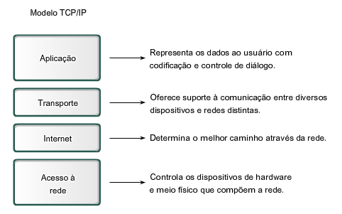
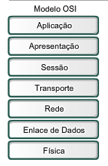
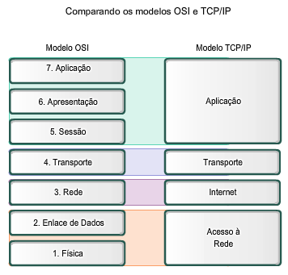

# Anotações 1° Avaliação

## Capitulo 2 - Comunicando-se pela rede

### Elementos da comunicação

A comunicação se inicia com uma informação ou mensagem que deve ser enviada de um individuo (ou dispositivo) para outro. As pessoas trocam ideias usando vários metodos de comunicação diferentes e todos esses métodos possuem três elementos em comum.

* O primeiro desses elementos é a origem da mensagem, ou remetente, que precisam enviar uma mensagem a outros individuos ou dispositivos.

* O segundo elemento é o destino, ou receptor, que recebe a mensagem e a interpreta.

* O terceiro elemento, chamaremos de canal, consiste no meio que fornece o caminho sobre o qual a mensagem poderá transitar da origem para o destino.

### Comunicando as mensagens

Em teoria uma única informação poderia ser enviada como um único fluxo massivo e continuo de bits, no entanto se as mensagens fossem realmente transmitidas dessa maneira, nenhum outro dispositivo poderia utilizar a mesma rede enquanto os dados circulassem, e isso resultaria em atrasos consideráveis.

Uma melhor abordagem encontrada foi dividir a mensagem em pedaços menores, essa divisão é chamada de **segmentação**. Segmentar gera dois grandes benefícios:

* Ao enviar pedaços menores, vários dispositivos podem conversar ao mesmo tempo de forma intercalada na mesma rede, processo de intercalar os pedaços em diferentes caminhos é denominado **multiplexação**.

* A segmentação aumenta a confiabilidade das comunicações, tendo em vista que cada mensagem não irá precisar necessariamente percorrer o mesmo caminho, dessa forma não há perigo de congestionamento. E caso alguma parte da mensagem falhe, apenas aquilo que foi perdido precisará ser reenviado.

No entanto o aspecto negativo de se utilizar a **multiplexação** e a **segmentação** é o nível de complexidade envolvida. Imagine se você tivesse de enviar 100 páginas mas cada envelope envolve apenas uma, o processo demandaria muito tempo.

Em comunicações de rede cada mensagem passa por um processo similar ao de o empacotamento de uma carta, para garantir que se chegue ao seu destino.

### Componentes da rede

O caminho que uma mensagem vai utilizar para chegar ao seu destino pode ser tão simples como um único cabo, ou tão complexo quanto uma rede que atravessa todo o planeta.

Dentre esses meios, existem o meio físico (mídia) que se constituem de componentes vísiveis como: Switch, cabos, um computador ou laptop, etc... No entanto o meio físico também pode ser invisível como no caso o ar, com a utilização de frequência de rádio e ondas eletromagneticas.

Além disso existem os serviços de rede, que são serviços que fornecem uma informação de resposta a alguma requisição ou solicitação.
Serviços incluem muitas das aplicações que utilizamos durante o dia-a-dia, como um serviço de hospedagem de e-mails ou serviços de hospedagem na nuvem.

### Dispositivos finais e seu papel na rede

Os dispositivos finais são aqueles que utilizamos e fornecem a interface entre a rede e nós humanos.
Alguns exemplos de dispositivos finais:

* Computadores
* Impressoras
* Camêras de segurança
* Celulares

No contexto de rede chamamos dispositivos finais de hosts, existem hosts de origem e de destino, podemos destinguir um do outro apartir do seu endereço, quando um host inicia a comunicação ele usa o endereço do outro host (de destino), para especificar aonde a mensagem deverá chegar.

Um host pode agir como um cliente ou servidor, ou ambos, o software instalado determina o seu papel.

* Servidores são hosts cujo o software instalado costuma ser especializado em **fornecer** informações ou serviços, como e-mail, ou páginas web a outros hosts.
* Clientes são hosts cujo software instalado é focado em solicitar e exibir as informações obtidas no servidor.
  
### Dispositivos intermediários e seu papel na rede

Fornecem conectividade e operam por trás do cenário de rede para garantir que as mensagems possam trafegar. Esses dispositivos conectam os hosts entre si.
Exemplos:

* Dispositivos de acesso a rede (Hubs, switchs e pontos de acesso sem fio)
* Roteadores
* Modems
* Firewalls

Além disso, eles também realizam o gerenciamento de dados enquanto eles fluem. Eles utilizam o endereço de destino além de um conjunto de informações para determinar qual o melhor caminho pelo qual a mensagem deve trafegar por meio de processos que são executados nestes dispositivos que executam as seguintes funções:

* Regenerar e retransmitir sinais
* Manter informação sobre quais caminhos existem pela rede
* Notificar outros dispositivos acerca de erros e falhas de comunicação
* Direcionar mensagens por caminhos alternativos quando necessário.
* Classificar e direcionar mensagems de acordo com prioridades (QoS)
* Permitir ou negar fluxo de dados

#### Tipos de meio físico

* Cabos de fios metalicos
* Fibra óptica
* Transmissão sem fio (wireless)

A codificação de sinal que ocorre em cada meio fisico é diferente, em fios metálicos os dados são enviados por meio de impulsos elétricos, já em fibra optica são passados por meio de feixes de luz, e em transmissões sem fio a comunicação acontece por meio de ondas eletromagnéticas que representam os valores de bit.

Diferentes meios físicos possuem diferentes características e individualidades, alguns são mais eficientes a grandes distâncias, outros são mais resistentes em ambientes externos, enquanto alguns são melhores quando há a necessidade de trafegar uma grande quantidade de dados, além disso cada um possui um custo especifico para o uso e instalação.

### Redes de área local

Uma Rede Local (ou **LAN**) geralmente se espalha por uma única área, fornecendo serviços para um determinada região, como por exemplo a rede de um campus, e costuma ser administrada por uma única organização.

### Redes de longa distância

Chamamos de **WAN** redes de longas distâncias que interconectam LANs, ou seja, quando uma empresa possui filiais que são separadas por grandes distâncias, pode ser necessário usar um provedor de telecomunicações para realizar a interconexão entre essas redes locais, e é ai que WAN entra.

### Intranet

Termo usado para se referir a conexões privadas, que pertencem a alguma organização específica que e só pode ser acessado por funcionários ou membros desta.

### Internet - Uma rede de redes

A internet pode ser definida como uma grande interconexão entre redes LAN e WAN, ou seja é um grande conglomerado de redes interconectadas que se comunicam entre si, permitindo o fluxo e passagem de informação a milhões de usuários ao redor do mundo.

### Regras que regem a comunicalção

Toda comunicação é regida por regras chamadas de protocolos. A comunicação com sucesso entre hosts em uma rede exige a interação de vários protocolos diferentes.

Uma das melhores formas de visualizarmos esse conjunto de protocolos é por meio de uma pilha. Eles são visualizados como uma hierarquia de camadas, cada npivel superior depende da funcionalidade definida pelos protocolos dos niveis inferiores.

Por exemplo, se fossemos fazer uma analogia com a comunicação humana poderiamos destacar 3 camadas de protocolos:

* Camada de conteúdo: Ou seja o assunto que será tratado nesta comunicação.
* Camada de regras: Seria o conjunto de regras necessárias para um diálogo, como por exemplo, use uma linguagem comum, aguarde sua vez e espere pra falar.
* Camada fisica: Temos duas pessoas que por meio da sua voz transmitem o que querem dizer pelo meio fisico (ar).

A importância da existência desses protocolos se dá pelo fato de que é necessário haver uma padronização para que desta forma, diferentes máquina de diferentes fabricantes e diferentes redes possam se comunicar, pois todas seguem os mesmo protocolos.

### A interação entre protocolos

Um exemplo do uso de um conjunto de protocolos é a comunicação entre um servidor web e um navegador, essa interação utiliza um número de protocolos e processos para que seja possivel a troca de informações.

Exemplos de protocolos:

* Protocolo de aplicação
  **Protocolo HTTP** é um protocolo comum que rege a maneira como um servidor e um cliente web interagem, o HTTP define o conteúdo e o formato das solicitações e respostas trocadas entre os hosts.

* Protocolo de transporte:
  **Protocolo TCP** é o protocolo que gerencia as conversar entre servidores e clientes web, O TCP divide as mensagem HTTP em pedaços menores, chamados de segmentos e os enviam ao host de destino, além de controlar o tamanho e a frequência em que as mensagens são trocadas.

* Protocolo de rede:
  O protocolo de rede mais comum é o **Protocolo IP**, ele retira os segmentos criados pelo TCP, encapsulando-os em pacotes e selecionando o melhor caminho para o destino.

* Protocolo de acesso a rede
  De forma resumida eles gerenciam o enlace de dados, removendo os pactes IP e formatando os dados para serem transmitidos para o meio fisico, exemplo: Ethernet.

Dessa forma, podemos definir protocolos como o que descreve as funções que ocorrem durante as operações de rede. E graças aos protocolos um computador pode acessar uma página web armazenada em qualquer tipo de servidor web que utiliza de qualquer sistema operacional, de qualquer lugar na internet.

## Modelos de Protocolo e de Referência

Um modelo de rede é apenas uma representação da operação da rede. Existem dois tipos basicos de modelos de rede.

**Modelo de protocolo**
  

Fornece um modelo que representa tipicamente toda a funcionalidade necessária para fazer a interface humano-rede. Ou seja o modelo **TCP/IP** é um modelo de protocolo pois descreve as funções que ocorrem em cada camada de protocolo.

Para que a comunicação ocorra segundo o modelo TCP/IP, o protocolo é implementado no host cliente e destino.

A informação passa por todas as camadas:

1. Criação de dados na camada de aplicação
2. Segmentação e encapsulamento dos dados
3. Geração dos dados no meio fisico na camada de acesso a rede
4. Trasporte dos dados através da rede
5. Recepção dos dados na camada de acesso a rede do dispositivo final de destino
6. Desencapsulamento e remontagem dos dados a medida que estes passam novamente em sentido contrário por todas as camadas.

### Unidades de dados de protocolos

A medida que os dados da aplicação transitam na pilha de protocolo, a forma que cada pedaço de dado é chamada muda.

* Dados - Termo geral para a PDU usada na camada de aplicação
* Segmento - PDU da camada de transporte
* Pacote - Camada de rede
* Quadro - Acesso a rede
* Bits - Meio fisico

**Modelo de referência**
  

Não tem a intenção de ser uma especificação de como tudo deve ser implementado, o principal propósito do modelo de referência é de auxiliar o entendimento dos processos e funções envolvidas, temos como exemplo o modelo **OSI**.

### Comparação entre modelos

Em resumo os dois modelos querem dizer a mesma coisa mas de formas diferentes, por exemplo o modelo OSI detalha a camada de aplicação do modelo TCP/IP, dividindo-o em quatro camadas, de forma que seja os processos envolvidos sejam exibidos de forma mais especifica.

Algo semelhante é visivel na camada de acesso á rede do TCP/IP que é divida em duas camadas no modelo OSI.
