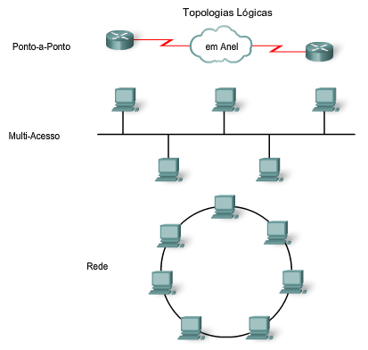

# Capitulo 7

## Recapitulação

O modelo OSI divide as funções de uma rede em camadas:

* A camada de aplicação fornece a interface para o usuário
* A camada de transporte é responsável pela divisão e gerenciamento das comunicações entre os processos que são executados entre os hosts
* Os protocolos da camada de rede organizam os dados da comunicação para que eles possam viajar através da conexão entre host de origem e destino.

Para que os pacotes da camada de rede cheguem ao destino a informação pode trafegar por diferentes meios físicos.

Podemos dizer que a camada de enlace do modelo OSI prepara os pacotes da camada de rede para que eles possam ser transmitidos pelo meio fisico.

A PDU (Unidade de dado de protocolo) da camada de enlace é o quadro.

Vamos imaginar a seguinte situação, dois computadores desejam se comunicar, um de Paris e outro do Japão.

Por mais que os dois se comuniquem usando o mesmo protocolo de rede (IP por exemplo), serão necessários inúmeros protocolos da camada de enlace para que a informação chegue ao destino, tendo em vista a quantidade de meios fisicos e dispositivos intermediários de rede diferentes, pelos quais a informações terá que trafegar para chegar ao destino.

## Criação de um quadro

O quadro é o elemento principal de cada protocolo da camada de enlace.

Para que a comunicação seja realizada o protocolo da camada de enlace prepara um pacote para o transporte através dele são encapsuladas informações com um cabeçalho e um trailer para criar o quadro.

Ele é dividido em:

* Dados - O pacote da camada de rede
* Cabeçalho - Contém informações de controle como endereçamento, e é localizado no inicio do quadro.
* Trailer - Informação de controle adicionada ao final do quadro.

A importância do quadro é que durante o processo de comunicação as informações são codificadas em bits, no entanto é necessário que se saiba aonde um dado acaba e aonde ele termina, para isso servem o cabeçalho e o trailer da PDU.

## Sub-camadas de enlace de dados

Para suportar uma grande variedade de funções de rede a camada de enlace é divida em sub-camadas, uma inferior e uma superior.

### Logical Link Control (LLC)

A subcamada LLC identifica no quadro qual protocolo de rede está sendo usado.

### Media Access Control (MAC)

Em resumo, subcamada MAC fornece o endereçamento fisico da camada de enlace.

## Controle de acesso ao meio

A camada de enlace também possui um controle de acesso ao meio

Existem diferentes controles de acesso ao meio como:

* Compartilhado:
  * Controlado - Os dispositivos se alternam para se comunicar, graças a detecção de colisão e a prevenção de colisão que verifica se há algum sinal no meio, caso o caminho esteja livre ele envia a informação para que seja trafegada.
  
  * Com base em contenção (disputa) - Os dispositivos enviam quando estiverem prontos.
  
* Não compartilhado - Em resumo uma conexão de ponta a ponta, que se divide em **full-duplex** aonde os dispositivos enviam e recebem informações ao mesmo tempo e o **half-duplex** em que as informações são enviadas e recebidas mas não ao mesmo tempo.
  

## Topologia de rede

Topologia de rede é a combinação ou o relacionamento dos dispositivos de rede a forma como eles se interconectam.

A **topologia física** é a combinação dos nós (hosts) e as conexões fisicas entre eles.

Abaixo um exemplo da **topologia lógica** e como ela se divide:

Por exemplo, utilizando novamente o exemplo dos dois computadores que estão em países diferentes, fisicamente falanado existem vários meios diferentes de conexão entre eles, mas logicamente falando, eles se comunicam apartir de uma topologia ponto-a-ponto, ou seja a topologia lógica desconsidera os processos físicos intermediários e dá enfase maior a conexão entre os dispositivos de origem e destino.

Ou seja, mesmo que a mensagem passe por vários tipos de conexão física, logicamente eles estão mandando uma mensagem diretamente (ponto-a-ponto) um com o outro.
